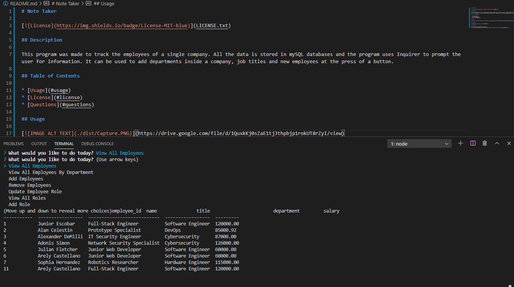

# Note Taker

## Description

This program was made to track the employees of a single company. All the data is stored in mySQL databases and the program uses Inquirer to prompt the user for information. It can be used to add departments inside a company, job titles and new employees at the press of a button. 

## Table of Contents

* [Usage](#usage)
* [License](#license)
* [Questions](#questions)
    
## Usage
    

## License

Licensed under the [MIT License](LICENSE.txt).

## Questions

My [GitHub](https://github.com/junioresc/)  
If you have any additional questions and would like to reach me, you can at junioresc1092@gmail.com